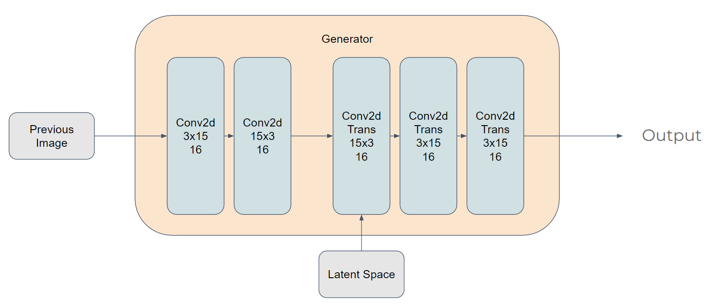

# Amadeus - A Classical Music Generation Recursive CNN GAN
Amadeus is a classical music generation Recursive CNN GAN built using Tensorflow Keras. 

## The Approach and Data Structure
The model took a visual approach to music generation, utilizing pianoroll as the medium.

In a pianoroll, the vertical axis is the pitch of the note, each pixel up is a halftone higher. The horizontal axis is time. In this case, each pixel to the right denotes 32ms forward in time. 

The pianoroll is stored in an array, with each pixel being a note. If the pixels are connected horizontally, they are treated as a long note. The intensity of the pixel is intended to be the velocity of a note, or, the strength the piano key is pressed down. However, this feature is not currently implemented due to complexity in training the model. 

The pianoroll representation is great for a CNN model, since each pixel is related in some way to its spacial neighbors - you can form chords by certain vertical composition, and extended notes by adding horizontally. 

## The Model
Generative Adverserial Networks, or GAN in short, is ideal for generating new data. The essence is to have a generator and discriminator competing trying to fool each other. The generator is trying to generate fake data and present then as real, where as the discriminator is trying to discriminate generated fake data from actual real ones. In a constant competition, they improve together, and eventually, we can take out the generator and it would generate real enough data for our purposes. 

### Generator

The generator is a typical generator with the encoder being a few layers of convolutional filter and the decoder being layers of transpose convolutional filter. The input of the generator is the output of the previour iteration, this way, the model can generate continuous music of any length, hence the "Recursive" in the name. 
