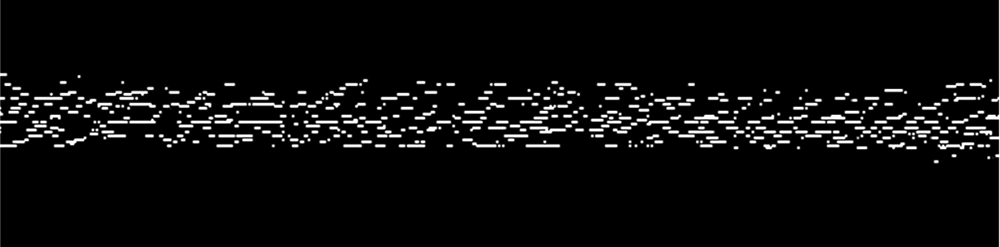

# Amadeus - A Classical Music Generation Recursive CNN GAN
Amadeus is a classical music generation Recursive CNN GAN built using Tensorflow Keras. 

## The Approach and Data Structure
The model took a visual approach to music generation, utilizing pianoroll as the medium.

In a pianoroll, the vertical axis is the pitch of the note, each pixel up is a halftone higher. The horizontal axis is time. In this case, each pixel to the right denotes 32ms forward in time. 

The pianoroll is stored in an array, with each pixel being a note. If the pixels are connected horizontally, they are treated as a long note. The intensity of the pixel is intended to be the velocity of a note, or, the strength the piano key is pressed down. However, this feature is not currently implemented due to complexity in training the model. 

The pianoroll representation is great for a CNN model, since each pixel is related in some way to its spacial neighbors - you can form chords by certain vertical composition, and extended notes by adding horizontally. 

## The Model
Generative Adverserial Networks, or GAN in short, is ideal for generating new data. The essence is to have a generator and discriminator competing trying to fool each other. The generator is trying to generate fake data and present then as real, where as the discriminator is trying to discriminate generated fake data from actual real ones. In a constant competition, they improve together, and eventually, we can take out the generator and it would generate real enough data for our purposes. 

### Generator

The generator is a typical generator with the encoder being a few layers of convolutional filter and the decoder being layers of transpose convolutional filter. The input of the generator is the output of the previour iteration, this way, the model can generate continuous music of any duration, hence the "Recursive" in the name. What is unique about the model is the filter shapes. 3x15 and 15x3 are long strips place horizontally or vertially. The intention is to capture the key duration in horizontal filter, and capture the chord composition in the vertical filter, this way, instead of packing everything into a square filter, we can dedicate each layer to a specific job, makeing the model easier to train and debug. 

### Discriminator

The discriminator in this model has two substructures. The first one is the typical discriminator, with a few layers of CNN and dense layers to form a final prediction of whether the input data is real or fake. There the discriminator takes both the current and the previous layer as input. This way, it can also examine whether the flow is continuous and that it as a metric for evaluating the realness of the inputted music. The second substructure is called a chord extractor. 

### Chord Extractor

The chord extractor, like its name suggests, extracts 10 common classical music chords and store their frequency and time of occurrence in an array, which is appended to the final dense layer input as an additional information in judging the realness of the music. This also allows mimicing certain styles. For example, if we train the model using composers who is known for using certain chords, the generted result will also mimic that chord composition since the discriminator will rate music without these chords as fake. 

## Training and Result
The model uses binary cross entropy as the loss for both generator and discriminator, and Adam as the loss function. The training set was about 60 pieces from Bach. The model was trained for 10000 epochs, for about 6 hours on a GTX 1080. 

Here are the final generated musics.

https://user-images.githubusercontent.com/34143179/190877703-dd33cf2f-5ac4-4202-9d8d-9b46a1b8f98a.mp4

https://user-images.githubusercontent.com/34143179/190877707-d841641f-6ed3-42b0-b7be-d3747482c1dd.mp4

## Acknowledgement
This is a class group project where each of our team member took a different approach to classical music generation (RNN, Transformer, etc.) and I mainly worked on the CNN approach. I want to thank my teammates for the suggestions and supports throughout the project, and thank our course superviser Dr. Ipek Oguz for advices. 

